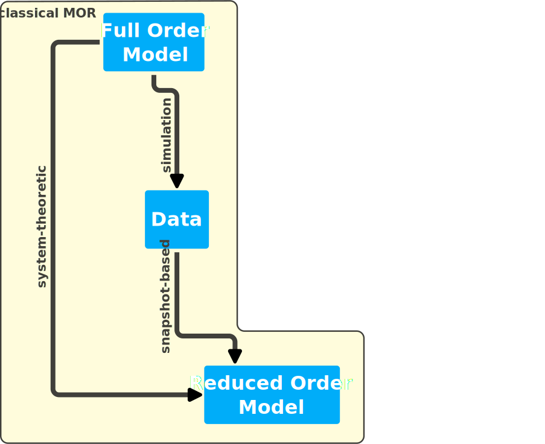
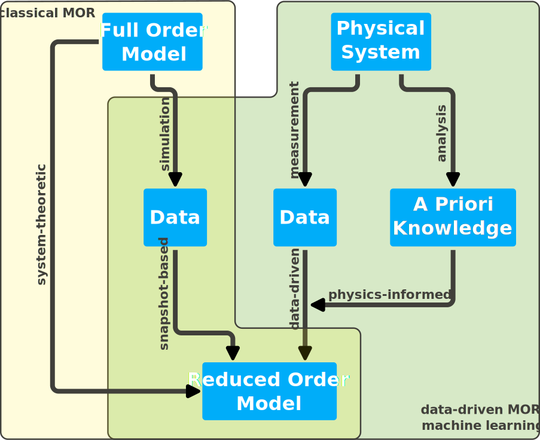

---
jupytext:
  text_representation:
    extension: .md
    format_name: myst
    format_version: 0.13
    jupytext_version: 1.15.1
kernelspec:
  display_name: Python 3 (ipykernel)
  language: python
  name: python3
---

```{code-cell} ipython3
---
slideshow:
  slide_type: '-'
---
# enable logging widget
%load_ext pymor.discretizers.builtin.gui.jupyter
```

+++ {"slideshow": {"slide_type": "slide"}}

# pyMOR -- Model Order Reduction with pyMOR

+++ {"slideshow": {"slide_type": "slide"}}

## What is Model Order Reduction?

+++ {"slideshow": {"slide_type": "fragment"}}



+++ {"slideshow": {"slide_type": "subslide"}}

## What is Model Order Reduction?



+++ {"slideshow": {"slide_type": "slide"}}

## What is pyMOR?

+++ {"slideshow": {"slide_type": "fragment"}}

pyMOR is ...

- a software library for writing **M**odel **O**rder **R**eduction applications
- in the **py**thon programming language.
- BSD-licensed, fork us on [GitHub](https://github.com/pymor/pymor).
- Everyone can contribute, everyone can become main developer.
- Started 2012, 25k lines of code (without tests), 9k commits.

+++ {"slideshow": {"slide_type": "subslide"}}

## Design Goals

+++ {"slideshow": {"slide_type": "fragment"}}

- **Goal 1:** One library for algorithm development *and* large-scale applications.
    - Small NumPy/SciPy-based discretization toolkit for easy prototyping.
    - `VectorArray`, `Operator`, `Model` interfaces for seamless integration with high-performance PDE solvers.

+++ {"slideshow": {"slide_type": "fragment"}}

- **Goal 2:** Unified view on MOR.
    - Implement RB and system-theoretic methods in one common language.

+++ {"slideshow": {"slide_type": "subslide"}}

## Implemented Algorithms

- Gram-Schmidt, POD, HAPOD
- Greedy basis generation with different extension algorithms
- Automatic (Petrov-)Galerkin projection of arbitrarily nested affine combinations of operators
- Interpolation of arbitrary (nonlinear) operators, EI-Greedy, DEIM
- A posteriori error estimation
- System theory methods: balanced truncation, IRKA, ...
- Structure-preserving methods: symplectic MOR, second-order systems, port-Hamiltonian systems
- Data-driven methods: DMD, Loewner, ANNs, ...
- Iterative linear solvers, eigenvalue computation, Newton algorithm, time-stepping algorithms

+++ {"slideshow": {"slide_type": "subslide"}}

## PDE Solvers

### Official Support:

- [deal.II](https://dealii.org)
- [FEniCS](https://fenicsproject.org)
- [NGSolve](https://ngsolve.org)
- [scikit-fem](https://github.com/kinnala/scikit-fem) (WIP)

### Used with:

- [DUNE](https://dune-project.org)
- [FEniCSx](https://fenicsproject.org)
- [BEST](https://www.itwm.fraunhofer.de/en/departments/sms/products-services/best-battery-electrochemistry-simulation-tool.html)
- [GridLOD](https://github.com/fredrikhellman/gridlod)
- file I/O, e.g. [COMSOL](https://comsol.com)
- ...

+++ {"slideshow": {"slide_type": "subslide"}, "jp-MarkdownHeadingCollapsed": true}

## Installation

pyMOR can be installed via `pip`. To follow this notebook, pyMOR should be installed with [Jupyter](https://jupyter.org) support:

```bash
pip install pymor[jupyter]
```

If you follow along in the terminal / in an IDE, you should install pyMOR using
the `gui` extra:

```bash
pip install pymor[gui]
```

We also provide [conda-forge](https://conda-forge.org) packages:

```bash
conda install -c conda-forge pymor
```

See [README.md](https://github.com/pymor/pymor/blob/main/README.md) for details.

+++ {"slideshow": {"slide_type": "subslide"}}

## Hello pyMOR!

```{code-cell} ipython3
---
slideshow:
  slide_type: fragment
---
import pymor
pymor.config
```

```{code-cell} ipython3
---
slideshow:
  slide_type: subslide
---
from pymor.basic import *
print_defaults()
```

+++ {"slideshow": {"slide_type": "subslide"}}

### Setting defaults

We need to disable WebGL-based visualizetions, as they render incorrectly in RISE:

```{code-cell} ipython3
---
slideshow:
  slide_type: '-'
---
set_defaults({'pymor.discretizers.builtin.gui.jupyter.get_visualizer.backend': 'MPL'})
```

+++ {"slideshow": {"slide_type": "subslide"}}

## Subpackages of the pymor Package

|                                |                                                      |
| :-                             | :-                                                   |
| **`pymor.algorithms`**         | generic algorithms                                   |
| **`pymor.analyticalproblems`** | problem descriptions for use with discretizers       |
| `pymor.bindings`               | bindings to external solvers                         |
| `pymor.core`                   | base classes/caching/defaults/logging                |
| **`pymor.discretizers`**       | create `Models` from `analyticalproblems`            |
| **`pymor.models`**             | `Model` interface/implementations                    |
| **`pymor.operators`**          | `Operator` interface/constructions                   |
| `pymor.parallel`               | `WorkerPools` for parallelization                    |
| **`pymor.parameters`**         | parameter support/`ParameterFunctionals`             |
| **`pymor.reductors`**          | most MOR algorithms (rest in `pymor.algorithms`)     |
| `pymor.scripts`                | executable scripts (`pymor-demo`, internal scripts)  |
| `pymor.tools`                  | non MOR-specific support code (pprint/floatcmp, ...) |
| **`pymor.vectorarrays`**       | `VectorArray` interface/implementations              |

+++ {"slideshow": {"slide_type": "slide"}}

## Example: Reduced Basis Method for Elliptic Problem

+++ {"slideshow": {"slide_type": "fragment"}}

- Snapshot- and projection-based MOR method for parameterized (PDE) models.
- Classic theory for elliptic parameter-separable problems.
- Extendable to non-linear/time-dependent/systems.
- Details: lecture tomorrow morning.

+++ {"slideshow": {"slide_type": "subslide"}}

### Thermal-block problem

Find $u(x, \mu)$ such that

$$
\begin{align}
-\nabla \cdot [d(x, \mu) \nabla u(x, \mu)] &= 1 & x &\in \Omega, \mu \in \mathcal{P} \\
u(x, \mu) &= 0 & x &\in \partial \Omega, \mu \in \mathcal{P}
\end{align}
$$

where $\Omega := [0,1]^2 = \Omega_1 \cup \Omega_2 \cup \Omega_3 \cup \Omega_4$


$$
d(x, \mu) \equiv \mu_i \text{ const.} \quad x \in \Omega_i
$$

and $\mu \in [\mu_{\min}, \mu_{\max}]^4$


```
        (0,1)---------(1,1)
        |        |        |
        |  μ_2   |  μ_3   |
        |        |        |
        |------------------
        |        |        |
        |  μ_0   |  μ_1   |
        |        |        |
        (0,0)---------(1,0)
```

+++ {"slideshow": {"slide_type": "fragment"}}

After discretization, we get prarameterized FOM:

$$
(L + \mu_0 L_0 + \mu_1 L_1 + \mu_2 L_2 + \mu_3 L_3) u(\mu) = f
$$

where $L, L_i \in \mathbb{R}^{n\times n}, \ \ u(\mu), f \in \mathbb{R}^n$.

+++ {"slideshow": {"slide_type": "subslide"}}

### Thermal-block problem in pyMOR

The thermal-block problem one of the (currently two) pre-defined FOMs in pyMOR:

```{code-cell} ipython3
---
slideshow:
  slide_type: '-'
---
from pymor.models.examples import thermal_block_example

fom_tb = thermal_block_example()
```

+++ {"slideshow": {"slide_type": "subslide"}}

### The FOM

`fom_tb` is an instance of `StationaryModel`, which encodes the mathematical structure
of the model through its `Operators`:

```{code-cell} ipython3
---
slideshow:
  slide_type: '-'
---
fom_tb
```

+++ {"slideshow": {"slide_type": "subslide"}}

### Solving the FOM

Let us compute and show the solution for particular parameter values:

```{code-cell} ipython3
---
slideshow:
  slide_type: '-'
---
mu = [0.1, 0.2, 0.5, 1]
U = fom_tb.solve(mu)
fom_tb.visualize(U)
```

+++ {"slideshow": {"slide_type": "subslide"}}

### Your turn

- Solve the FOM for another set of parameter values.
- Visualize the new solution along the old one.
- Also show the difference between both solutions.

**Hint:** You can pass a tuple of solutions `visualize`.

```{code-cell} ipython3
---
slideshow:
  slide_type: '-'
---
mu2 = ...
...
fom_tb.visualize(...)
```

+++ {"slideshow": {"slide_type": "subslide"}}

### Choosing a redutor

To build the reduced-order model (ROM), we need to create a `reductor`:

```{code-cell} ipython3
---
slideshow:
  slide_type: '-'
---
from pymor.parameters.functionals import ExpressionParameterFunctional
from pymor.reductors.coercive import CoerciveRBReductor

reductor = CoerciveRBReductor(
    fom_tb,
    product=fom_tb.h1_0_semi_product,
    coercivity_estimator=ExpressionParameterFunctional('min(diffusion)',
                                                       fom_tb.parameters)
)
```

+++ {"slideshow": {"slide_type": "-"}}

- The `reductor` takes care of projecting the FOM to a ROM.
- It also build an error estimator, for which `product` and `coercivity_estimator` is needed.

+++ {"slideshow": {"slide_type": "subslide"}}

### Basis generation

We need to compute a reduced space, onto which `reductor` projects. We use a greedy algorithm for that:

```{code-cell} ipython3
---
slideshow:
  slide_type: '-'
---
from pymor.algorithms.greedy import rb_greedy

parameter_space = fom_tb.parameters.space(0.1, 1)
greedy_data = rb_greedy(fom_tb, reductor, parameter_space.sample_randomly(1000),
                        rtol=1e-2)
rom_tb = greedy_data['rom']
```

+++ {"slideshow": {"slide_type": "-"}}

- Greedy search over training set of 1000 random parameters
- Fast thanks to efficient error estimator.
- FOM only solved for selected snapshot parameters.

+++ {"slideshow": {"slide_type": "subslide"}}

### The ROM

ROM is also a `StationaryModel`, but of lower order:

```{code-cell} ipython3
---
slideshow:
  slide_type: '-'
---
rom_tb
```

+++ {"slideshow": {"slide_type": "subslide"}}

### Comparing FOM and ROM solutions

ROM solution:

```{code-cell} ipython3
---
slideshow:
  slide_type: '-'
---
U_rom = rom_tb.solve(mu)
U_rom
```

+++ {"slideshow": {"slide_type": "fragment"}}

Reconstruct and compare to FOM solution:

```{code-cell} ipython3
---
slideshow:
  slide_type: '-'
---
U_rec = reductor.reconstruct(U_rom)
fom_tb.visualize(U - U_rec)
```

+++ {"slideshow": {"slide_type": "subslide"}}

### Is it faster?

Finally, we check that the reduced-order model is indeed faster:

```{code-cell} ipython3
---
slideshow:
  slide_type: '-'
---
from time import perf_counter
tic = perf_counter()
fom_tb.solve(mu)
toc = perf_counter()
rom_tb.solve(mu)
tac = perf_counter()
print(f't_fom: {toc-tic}  t_rom: {tac-toc}  speedup: {(toc-tic)/(tac-toc)}')
```

+++ {"slideshow": {"slide_type": "subslide"}}

### Your turn

- Validate the FOM by computing the maximum error between `ROM` and `FOM` solution on a validation set of 10 random parameter values.

```{code-cell} ipython3
---
slideshow:
  slide_type: '-'
---
validation_set = parameter_space.sample_randomly(...)
errors = []
for mu in ...:
    u_rom = ...
    U_rom = ...
    U_fom = ...
    U_err = ...
    err = U_err.norm()[0]
    errors.append(err)
    
print(max(errors))
```

+++ {"slideshow": {"slide_type": "slide"}}

## Example: Balanced Truncation for LTI System

+++ {"slideshow": {"slide_type": "fragment"}}

*Details in a lecture tomorrow.*

Here we consider a synthetic linear time-invariant (LTI) system of the form

$$
\begin{align*}
  \dot{x}(t) & = A x(t) + B u(t), \\
  y(t) & = C x(t),
\end{align*}
$$

where
$x(t) \in \mathbb{R}^n$ is the state,
$u(t) \in \mathbb{R}^m$ is the input, and
$y(t) \in \mathbb{R}^p$ is the output.

```{code-cell} ipython3
---
slideshow:
  slide_type: subslide
---
from pymor.models.examples import penzl_example

fom_lti = penzl_example()
```

+++ {"slideshow": {"slide_type": "fragment"}}

The result is an `LTIModel`:

```{code-cell} ipython3
---
slideshow:
  slide_type: '-'
---
fom_lti
```

```{code-cell} ipython3
---
slideshow:
  slide_type: fragment
---
print(fom_lti)
```

+++ {"slideshow": {"slide_type": "subslide"}}

We can use the Bode plot to show the frequency response of the LTI system, i.e.,
to see which input frequencies are amplified and phase-shifted in the output.

```{code-cell} ipython3
---
slideshow:
  slide_type: '-'
---
w = (1e-1, 1e5)
_ = fom_lti.transfer_function.bode_plot(w)
```

+++ {"slideshow": {"slide_type": "subslide"}}

We can run balanced truncation to obtain a reduced-order model.

```{code-cell} ipython3
---
slideshow:
  slide_type: '-'
---
from pymor.reductors.bt import BTReductor

bt = BTReductor(fom_lti)
rom_lti = bt.reduce(10)
```

+++ {"slideshow": {"slide_type": "subslide"}}

The reduced-order model is again an `LTIModel`, but of lower order.

```{code-cell} ipython3
---
slideshow:
  slide_type: '-'
---
rom_lti
```

+++ {"slideshow": {"slide_type": "subslide"}}

Looking at the error system, we can see which frequencies are well approximated.

```{code-cell} ipython3
---
slideshow:
  slide_type: '-'
---
err_lti = fom_lti - rom_lti
_ = err_lti.transfer_function.mag_plot(w)
```

+++ {"slideshow": {"slide_type": "subslide"}}

### Your turn

1. Change the reduced order above from 10 to 5, then regenerate the error plot.
2. Change the reduced order to 20 and regenerate the plot.

+++ {"slideshow": {"slide_type": "slide"}}

## Running Demo Scripts

pyMOR ships several example scripts that showcase various features of the library.
While many features are also covered in our tutorials, the demos are more extensive
and often have various command-line flags which allow to run the script for different
parameters or problems.
All demos can be found in the [src/pymordemos](https://github.com/pymor/pymor/tree/main/src/pymordemos)
directory of the source repository.

The demo scripts can be launched directly from the source tree:

```
./thermalblock.py --plot-err --plot-solutions 3 2 3 32
```

or by using the `pymor-demo` script that is installed with pyMOR:

```
pymor-demo thermalblock --plot-err --plot-solutions 3 2 3 32
```

## Getting help

- pyMOR's documentation can be found at

  > https://docs.pymor.org/latest

- Be sure to read the [introduction](https://docs.pymor.org/latest/getting_started.html),
  the [technical overview](https://docs.pymor.org/latest/technical_overview.html) and
  the [tutorials](https://docs.pymor.org/latest/tutorials.html).

- Ask questions on

  > https://github.com/pymor/pymor/discussions
